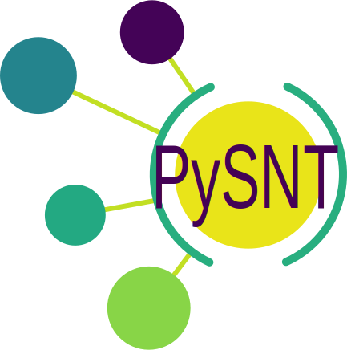

<h1 align="center">PySNT</h1>
<h2 align="center">Python wrapper for SNT, the ImageJ framework  for Neuroanatomy</h2>

  <!-- License -->
  
  <!-- Forum -->
  
  <!-- Issues -->
  
  

  <h3>
    <a href="https://pysnt.readthedocs.io/en/latest/install.html">
      Installation
    </a>
    |
    <a href="https://pysnt.readthedocs.io/en/latest/index.html">
       Documentation
    </a>
    |
    <a href="https://forum.image.sc/tag/SNT">
      Support
    </a>
  </h3>

<h3 align="center">⚠️ This project remains experimental. Feedback welcome! ⚠️ </h3>

## Contributing

Want to contribute? Please, please do! We welcome [issues](https://github.com/morphonets/pysnt/issues) and [pull requests](https://github.com/morphonets/pysnt/pulls) any time. You can also report bugs and propose improvements using the [forum](https://forum.image.sc/tag/snt). Please tag your post using `snt` so that it does not go unnoticed.
